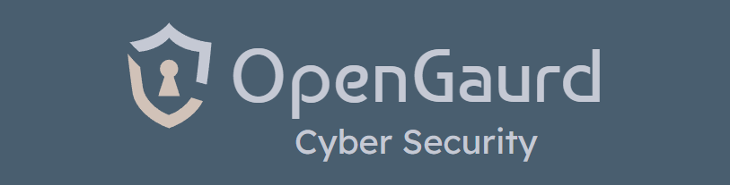

# OpenGuard Vulnerability Scanner

OpenGuard is an open-source vulnerability scanning tool designed to identify security weaknesses in systems and networks. As a fork and enhancement of the OpenVAS (Open Vulnerability Assessment System) project, OpenGuard offers comprehensive vulnerability scanning capabilities, making it an essential tool for security professionals, system administrators, and network engineers.



## Table of Contents

- [Features](#features)
- [Prerequisites](#prerequisites)
- [Building the Docker Image](#building-the-docker-image)
- [Running with Docker Compose](#running-with-docker-compose)
- [Usage](#usage)
- [Configuration](#configuration)
- [Contributing](#contributing)
- [License](#license)

## Features

The Greenbone Source code can be found at:
[Greenbone Source Code](https://github.com/greenbone)

- Extensive Vulnerability Database: OpenGuard utilizes a vast and regularly updated database of vulnerabilities to ensure the latest threats are detected.
- Automated Scanning: Automate the scanning process to identify vulnerabilities across various network devices, applications, and systems.
- Detailed Reporting: Generate comprehensive reports that include detailed findings, risk ratings, and recommended remediation steps.
- Customizable Scans: Tailor scans to meet specific needs by configuring scan parameters and selecting targeted areas for assessment.
- Integration Capabilities: Seamlessly integrate with other security tools and platforms to enhance overall security posture.

The advantages of the Opengaurd container image vs the Greenbone images:
- Able to run a full scanner in a sinlge image with or without volumes. 
- Image contains a full database.
- Speed to scanning. The Immauss image can be up and scanning in 15-20 minutes. ( With sufficent machine resources).
- The image on docker hub is updated weekly to ensure the database is up to date.

The the latest image is based on GVM 22.4.x  In single container mode, it runs all the components needed to create a scanner in a single container including:
- gvmd - the Greenbone Vulnerability Managedment daemon
- openvas scanner - the scanner component of GVM
- ospd - the openvas scanner protocal daemon
- notusscanner - the new piece from Greenbone that handles the local scans of machines.
- postgresql - the database backend for the scanner and gvm
- redis - in memory database store used by gvmd 
- postfix mail server for delivering email notices from GVM
- A copy of the baseline data feeds and associated database
- Option to restore from existing postgresql database dump
- Option to skip the data sync on startup
- Proper database shutdown on container stop to prevent db corruption. 

In multi-container mode it creates individual containers for each of the components. Since most of the Greenbone components utlize unix sockets for comunication, the contianers share a volume (the default name is: ovasrun) soley for the sharing of the sokets.`

## Prerequisites

Before you begin, ensure you have the following installed:

- [Docker](https://www.docker.com/get-started)
- [Docker Compose](https://docs.docker.com/compose/install/)

## Building the Docker Image

To build the OpenGuard Docker image, follow these steps:

1. Clone the repository:
    ```sh
    git clone https://github.com/aadarsh79/opengaurd.git
    cd opengaurd
    ```

2. Build the Docker image:
    ```sh
    docker build -t aadarsh79/opengaurd .
    ```

3. Or you can pull it from Docker Hub
    ```sh
    docker pull aadarsh79/opengaurd:latest
    ```

## Running the Docker Container Manually

To run the Docker container manually, use the following command:

```sh
docker run --detach --publish 9300:9392 -e PASSWORD=admin --volume openvas:/data --name opengaurd aadarsh79/opengaurd
```
Depending on your hardware, it can take anywhere from a few seconds to 30 minutes while the NVTs are scanned and the database is rebuilt. 

The NVTs will update every time the container starts. Even if you leave your container running 24/7, the easiest way to update your NVTs is to restart the container.
```
docker restart openvas
```

There is also a script in the container that will initiate the sync. 
```
/scripts/sync.sh
```
You can run the sync at anytime on a running container with:
```
docker exec -it <container-name> /scripts/sync.sh
```

## Running with Docker Compose

1. There is a `docker-compose.yml` file in the compose directory of your project:

2. Start OpenGuard Docker Service:
    ```sh
    docker-compose -f compose/docker-compose.yml up -d
    ```

3. Check the status of the containers:
    ```sh
    docker-compose ps
    ```

## Usage

Once OpenGuard is up and running, you can access the web interface at `http://localhost:9300`. From here, you can start new scans, view reports, and configure settings.

## Contributing

We welcome contributions from the community. If you would like to contribute to OpenGuard, please follow these steps:

1. Fork the repository
2. Create a new branch (`git checkout -b feature-branch`)
3. Commit your changes (`git commit -am 'Add new feature'`)
4. Push to the branch (`git push origin feature-branch`)
5. Create a new Pull Request

For major changes, please open an issue first to discuss what you would like to change.

## License

OpenGuard is released under the [MIT License](LICENSE).

